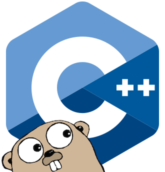

`chan`
======
Go-like channels in C++

Why
===
I want to able to `select` on both file read/writes _and_ C++ object channel
send/receives.

Currently the only option seems to be to drop down to POSIX and use `poll`.
So, this library wraps that up into a convenient set of abstractions.

What
====
`chan` is a C++ library defined in `namespace chan`, whose main elements are:

- `class Chan<T>`: an unbuffered channel of C++ objects of type `T`.
- `class File`: a file open for reading or writing or both.
- `deadline`: a function returning an object that represents a timeout at a
  future point in time.
- `timeout`: a function returning an object that represents a timeout after
  an interval of time.
- `select`: a function that takes one or more "events" and returns the argument
  index of the event that was fulfilled first.  The other events will _not_
  have been fulfilled.

The resulting combination is a selectable channel facility reminiscent of
[Go][go], but that works seamlessly with file read/writes in addition to
channel send/receives.

How
===
Here's a program that reads `StockTick` objects from a library, publishes
metrics every two seconds, and exits when any standard input is entered:
```C++
#include <chan/chan.h>
#include <chan/file.h>
#include <chan/select.h>
#include <stock_exchange.h>
#include <iostream>

chan::Chan<StockTick> subscribe();
void processStockTick(const StockTick&);
void publishMetrics();

int main(int argc, char *argv[])
{
    chan::File            input    = chan::standardInput();
    chan::Chan<StockTick> ticks    = subscribe();
    const chan::Duration  interval = chan::seconds(2);
    chan::TimePoint       when     = chan::now() + interval;
    StockTick             tick;

    using chan::select;
    using chan::deadline;

    for (;;) {
        switch (select(input.read(), ticks.recv(&tick), deadline(when))) {
          case 0:
            std::cout << "Exiting due to caller input.\n";
            return 0;
          case 1:
            processStockTick(tick);
            break;
          case 2:
            publishMetrics();
            when = Datetime::now() + interval;
            break;
          default:
            std::cerr << chan::lastError().what() << "\n";
        }
    }
}
```

Here's a function, meant to be run on its own thread, that reads lines from an
input file/pipe/socket and then sends them as `std::string` objects on a
`Chan`nel, but quits if there's ever input on a "done" `Chan`nel:
```C++
#include <chan/chan.h>
#include <chan/file.h>
#include <chan/select.h>
#include <iostream>

void lines(int                     fileDescriptor,
           chan::Chan<std::string> output,
           chan::Chan<>            done,
           std::string             delimiter = "\n")
{
    std::string current;
    chan::File  input(fileDescriptor);

    using chan::select;

    for (;;) {
        switch (select(input.read(current), done.recv())) {
          case 0: {
              std::size_t pos = 0;
              for (;;) {
                  std::size_t delim = current.find(delimiter, pos);
                  if (delim == std::string::npos)
                      break;
                
                  std::string message = current.substr(pos, delim);
                  if (select(output.send(message), done.recv()) == 1)
                      return;

                  pos = delim + delimiter.size();
              }
              current.erase(0, pos);
          } break;
          case 1:
              return;
          default:
              std::cerr << chan::lastError().what() << "\n";
              return;
        }
    }
}
```

Finally, here's a plain old job-consuming worker; no `select` required:
```C++
void worker(chan::Chan<std::function<Result()> jobs,
            chan::Chan<Result>                 results)
{
    for (;;) {
        const std::function<Result()> job = jobs.recv();

        if (!job)
            // an unset function object indicates "quit"
            return;

        results.send(job());
    }
}
```

Keep in mind that since `Chan`nels are not buffered, the last example is not
the same thing and consuming from and producing to queues, but instead only
allows the computing power at a particular stage of a data pipeline to be
increased (by using more workers).

[go]: https://golang.org/
