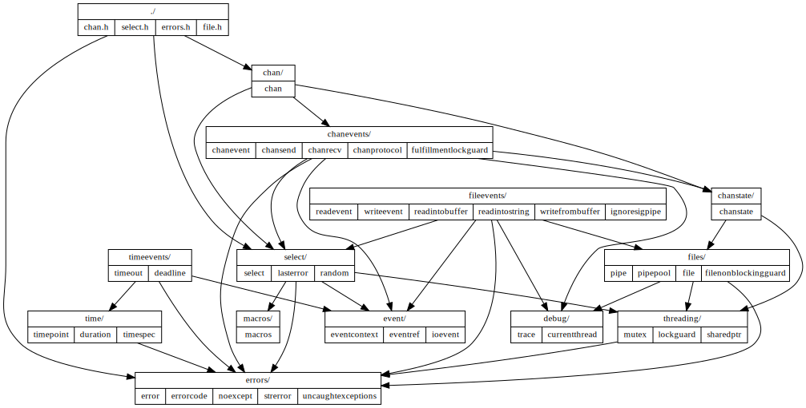

`src/`
======
This library contains thirteen packages having seven levels of dependency.
Each subdirectory is a package, while the header files in this directory
(`src/`) are the "public API" meant to be included in user code.

Dependency Hierarchy
--------------------
Each vertex (table) in the following graph is a package (with the exception of
`./`, which is a collection of public headers rather than a package).  Within
each package are listed its components (translation units).  An arrow goes from
one package to another if the former package depends upon the latter.
Components within a package may depend upon other components within the same
package, or on components within packages further down the hierarchy.
Dependencies are noncyclic and strictly hierarchical.

